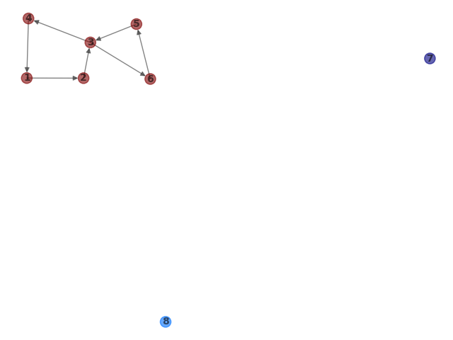
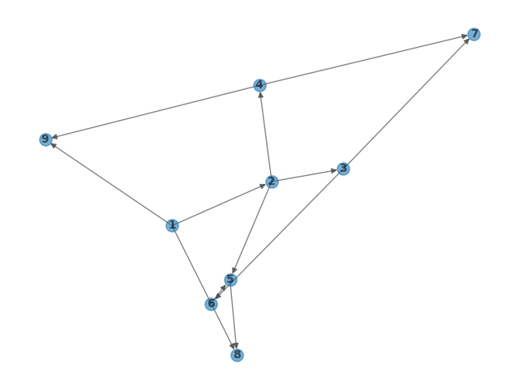
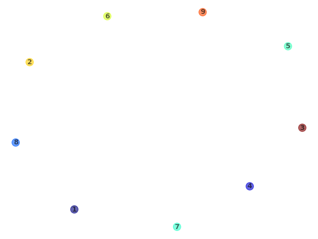
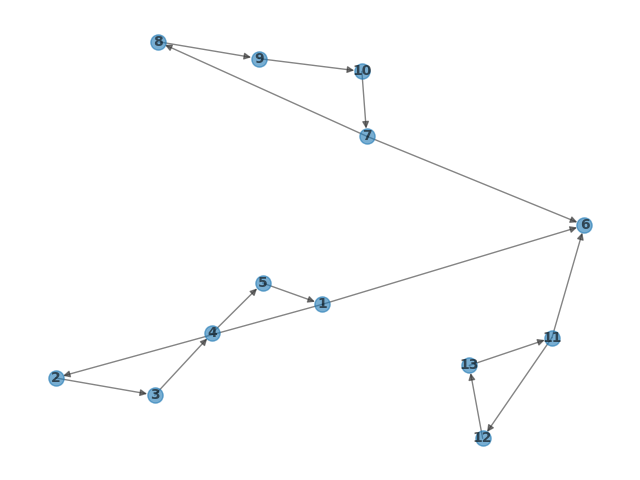
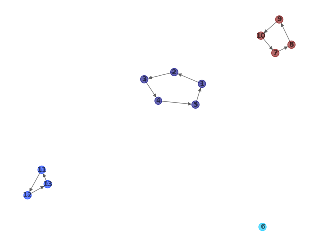
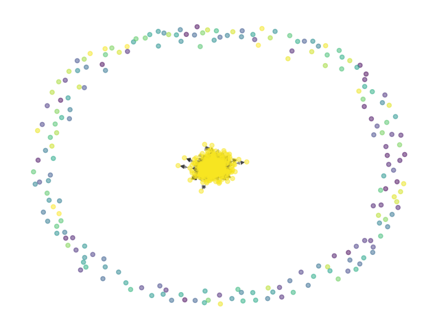
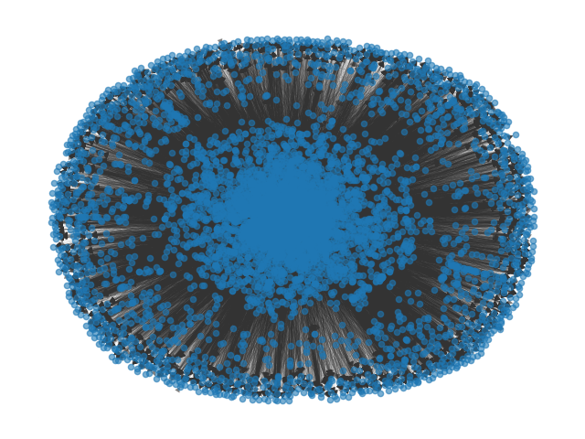
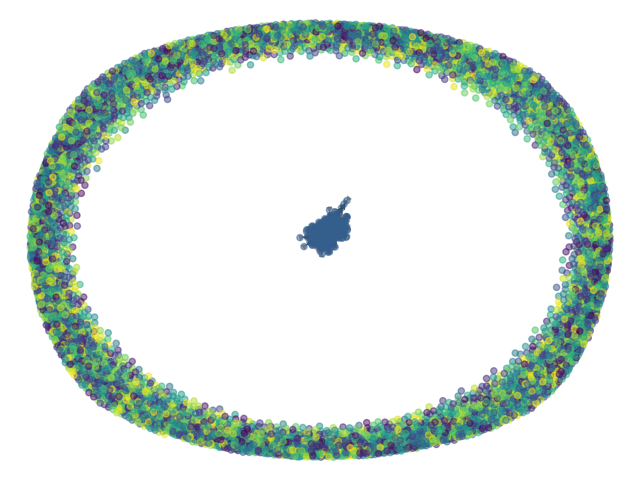

# Results

Results Produced

Dataset      | Results |  Kosaraju's Algorithm (Time taken)       |  Divide and Conquer Algorithm(Time taken)
:-----------:|:-----:|:-----------------------:|:-------------------------:
1) test1          | Nodes: 8 Edges: 11 num of scc: 3             | 0.013s | 0.001s 
2) test2          | Nodes: 9 Edges: 12 num of scc: 9             | 0.018s | 0.001s 
3) test3          | Nodes: 13 Edges: 15 num of scc: 4            | 0.007s | 0.001s 
4) test4          | Nodes: 9 Edges: 11 num of scc: 2             | 0.007s | 0.001s 
5) email-EU-core  | Nodes: 1005 Edges: 25571 num of scc: 203     | 0.129s | 0.013962s
6) Wiki-Vote      | Nodes: 7115 Edges: 103689 num of scc: 5816   | 0.665s | 7.07455s
7) p2p-Gnutella04 | Nodes: 10876 Edges: 39994 num of scc: 6560   | 0.316s | 12.6027s 
8) soc-Epinions1  | Nodes: 75879 Edges: 508837 num of scc: 42176 | 4.174s | 668.653s 

### Graphs

Dataset | Directed Graph (combined)      |  Strongly Connected Components
:--:|:-------------------------:|:-------------------------:
1) test1 | | 
2) test2 | | 
3) test3 | | 
4) test4 | | 
5) email-Eu-core |  | 
6) Wiki-Vote |  | 
7) p2p-Gnutella04 |  | 